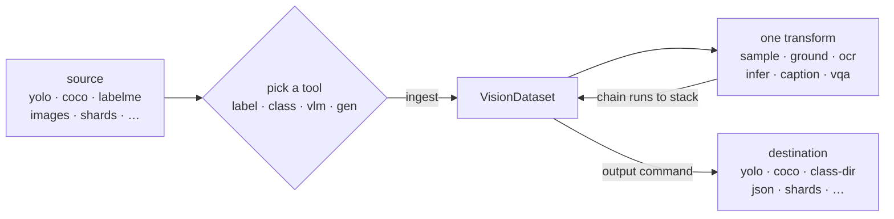

# cvsuite

`cvsuite` is a computer vision toolkit for reproducible, filesystem-to-filesystem dataset work, organized around one CLI:

```bash
cvsuite <branch> <src> [transform] <output>
```

Convert between annotation formats (YOLO, COCO, LabelMe, class folders, segmentation masks, VQA manifests). Auto-label raw images from a text prompt with foundation grounding models such as SAM 3 or Grounding DINO. Caption them or answer questions about them with vision-language models. Sort them into class folders with zero-shot classifiers. Read text off them with OCR. Generate and edit images with diffusion models. Then do the unglamorous half of the job: unzip and flatten a dump of files, drop exact and near-duplicates, fix orientation, normalize size and format, and draw a balanced sample for training.

```bash
cvsuite label ./dataset-yolo to-coco ./dataset-coco
cvsuite label ./images ground --provider gsam --prompt "fire, smoke" to-coco ./labeled
cvsuite vlm ./images caption --provider qwen to-json ./captions
cvsuite class ./images infer --provider clip --prompt "good,bad" to-class-dir ./sorted
cvsuite gen create --provider flux --prompt "a red fox in the snow" to-dst ./fox.png
cvsuite prep arrange ./dump ./clean --unzip --exact-dedup --rename-seq
```

More in the [cookbook](https://github.com/ptonso/cv-suite/blob/main/docs/cookbook.md).

You point a branch at a source, optionally run a transform, and materialize a destination layout. There is deliberately no universal "convert anything to anything" command.

## How it works



Whichever tool you pick, the spine is the same: the source is ingested into a shared `VisionDataset`, transforms mutate that dataset, and an output command materializes it. What differs per tool is the ingest heuristics, which transforms exist, and the export rules.

Each run applies at most one transform, so you stack them by chaining runs: the destination of one becomes the source of the next. FM-backed transforms (`ground`, `ocr`, `infer`, `caption`, `vqa`, and the `gen` actions) hand the dataset to an isolated provider subprocess that mutates records in place. `cvsuite prep` is the exception to all of this, since it works directly on folders and never builds a dataset.

## Branches

| Branch | Purpose |
|---|---|
| `cvsuite label` | annotated datasets: YOLO / COCO / LabelMe / image-only ingest, `sample` / `ground` / `ocr` / `ops` / `filter` transforms, export to any label format |
| `cvsuite class` | class-directory datasets: `infer` with zero-shot classifiers, class-aware `sample`, export via `to-class-dir` |
| `cvsuite vlm` | vision-language datasets: `caption` / `ask` / `vqa` / `map-answers`, export to flat JSON / shards / VQA-style |
| `cvsuite gen` | text-to-image and image-edit generation, materialized via `to-dst` |
| `cvsuite prep` | raw image folder cleanup: `arrange` / `process` / `sample` / `orient`, file-first |
| `cvsuite common` | shared operations: FM cache paths, inspection, and purge |

## Install

```bash
pip install cv-suite
```

Or from source:

```bash
git clone https://github.com/ptonso/cv-suite
pip install -e ./cv-suite
```

The base install ships the CLI and the I/O layer. Foundation-model backends run in isolated per-model virtualenvs provisioned on first use. See [`docs/getting-started.md`](https://github.com/ptonso/cv-suite/blob/main/docs/getting-started.md).

## Documentation

- [`docs/`](https://github.com/ptonso/cv-suite/tree/main/docs) contains the guides: the [mental model](https://github.com/ptonso/cv-suite/blob/main/docs/index.md), [getting started](https://github.com/ptonso/cv-suite/blob/main/docs/getting-started.md), and a [cookbook](https://github.com/ptonso/cv-suite/blob/main/docs/cookbook.md) of common workflows.
- [`specs/`](https://github.com/ptonso/cv-suite/tree/main/specs) is the technical source of truth: architecture, the dataset contract, per-branch behavior, business decisions, and the guardrails that must not break.

## Names

- PyPI distribution: `cv-suite`
- import package and CLI: `cvsuite`

## License

MIT. See [LICENSE](https://github.com/ptonso/cv-suite/blob/main/LICENSE).
